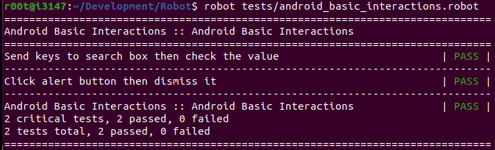
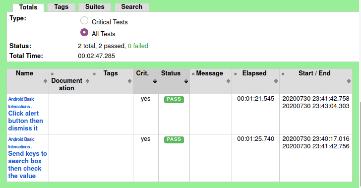

### Install robot framework environment
```
pip install robotframework robotframework-requests robotframework-appiumlibrary
```
### Http request Data Driven Test
```
*** Settings ***
Documentation   Robot Framework Demo
Library         RequestsLibrary

*** Variables ***
${url}          https://www.google.com/search?q=

*** Test Cases ***
Find Results
    [Template]  The search of ${item} returns ${expected}
        1111*1111        1234321
        11111*11111      123454321
        111111*111111    12345654321
        1111111*1111111  1234567654321

*** Keywords ***
The search of ${item} returns ${expected}
    create session    alias        ${url}${item}
    ${out} =          get request  alias  /
    status should be  200          ${out}
    should contain    ${out.text}  ${expected}
    delete all sessions
```

***Windows***


### Appium Android Test
* [Appium Getting Started](http://appium.io/docs/en/about-appium/getting-started/)

* [The Appium](https://github.com/serhatbolsu/robotframework-appiumlibrary) server itself defines custom extensions to the official protocols, giving Appium users helpful access to various device behaviors (such as installing/uninstalling apps during the course of a test session). This is why we need Appium-specific clients, not just the 'vanilla' Selenium clients.
```
*** Settings ***
Documentation   Android Basic Interactions
Resource        ../resources/setup.robot
Test Teardown   Close Application

*** Test Cases ***
Send keys to search box then check the value
    Open Android Application            .app.SearchInvoke
    input text                          txt_query_prefill  Hello world!
    click element                       btn_start_search
    wait until page contains element    android:id/search_src_text
    element text should be              android:id/search_src_text  Hello world!

Click alert button then dismiss it
    Open Android Application            .app.AlertDialogSamples
    click element                       two_buttons
    wait until page contains element    android:id/alertTitle
    element should contain text         android:id/alertTitle  Lorem ipsum dolor sit aie consectetur adipiscing
    ${close_button}  get webelement     android:id/button1
    click element                       ${close_button}
```
***Ubuntu 20.04***





### Appium iOS Test
* MacOS 10.11+ required
```
*** Settings ***
Resource       ../resources/setup.robot
Test Setup     Open iOS Application
Test Teardown  Close Application

*** Test Cases ***
Send keys to inputs
    ${text_field}   get webelement          TextField1
    ${value}        get element attribute   ${text_field}   value
    should be equal                         ${value}        ${None}
    input text                              ${text_field}   Hello World!
    ${value2}       get element attribute   ${text_field}   value
    should be equal                         ${value2}       Hello World!

Click alert button
    click element                           show alert
    ${alert}  get webelement                accessibility_id=Cool title
    ${title}  get element attribute         ${alert}        name
    should be equal                         ${title}        Cool title
```
***MacOS todo***

[Python Client](https://github.com/appium/python-client)

[Basic writing and formatting syntax](https://help.github.com/articles/basic-writing-and-formatting-syntax/)
