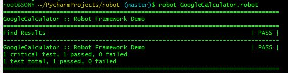
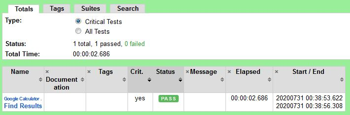

### Install robot framework environment
```
pip install robotframework
pip install robotframework-requests
```
### Http request Data Driven Test
```
*** Settings ***
Documentation   Robot Framework Demo
Library         RequestsLibrary
*** Variables ***
${url}          https://www.google.com/search?q=
*** Test Cases ***
Find Results
    [Template]  The search of ${item} returns ${expected}
        1111*1111        1234321
        11111*11111      123454321
        111111*111111    12345654321
        1111111*1111111  1234567654321
*** Keywords ***
The search of ${item} returns ${expected}
    create session    alias         ${url}${item}
    ${resp}=          get request   alias  /
    status should be  200           ${resp}
    should contain    ${resp.text}  ${expected}
    delete all sessions
```




### Appium Android/iOS test
[The Appium](https://github.com/serhatbolsu/robotframework-appiumlibrary) server itself defines custom extensions to the official protocols, giving Appium users helpful access to various device behaviors (such as installing/uninstalling apps during the course of a test session). This is why we need Appium-specific clients, not just the 'vanilla' Selenium clients. 
```
# Android environment
import unittest
from appium import webdriver

desired_caps = dict(
    platformName='Android'
    platformVersion='10'
    automationName='uiautomator2'
    deviceName='Android Emulator'
    app=PATH('../../../apps/selendroid-test-app.apk')
)
self.driver = webdriver.Remote('http://localhost:4723/wd/hub', desired_caps)
el = self.driver.find_element_by_accessibility_id('item')
el.click()
```

```
# iOS environment
import unittest
from appium import webdriver

desired_caps = dict(
    platformName='iOS'
    platformVersion='13.4'
    automationName='xcuitest'
    deviceName='iPhone Simulator'
    app=PATH('../../apps/UICatalog.app.zip')
)

self.driver = webdriver.Remote('http://localhost:4723/wd/hub', desired_caps)
el = self.driver.find_element_by_accessibility_id('item')
el.click()
```
[Python Client](https://github.com/appium/python-client)

[Basic writing and formatting syntax](https://help.github.com/articles/basic-writing-and-formatting-syntax/)
